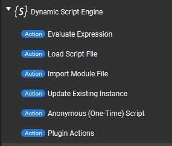
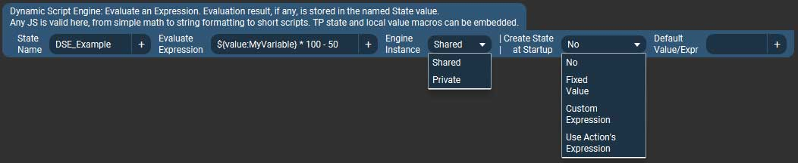
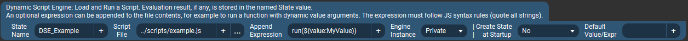
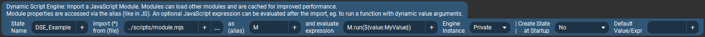
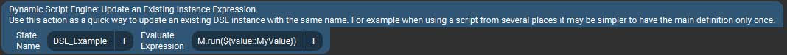
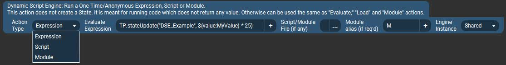
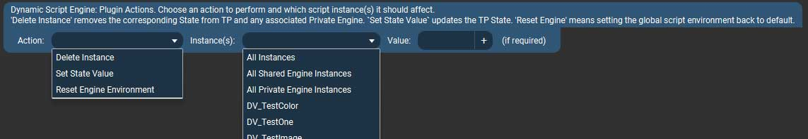

# Plugin Actions {#plugin_actions}

[TOC]

## Available Actions

### Evaluate Expression {#plugin_actions_evaluate}

This is the most basic action which creates a new State with the value of whatever the given expression results in. The other actions described below all share
the same options (as well as add some others). The common options are only explained here.

* **State Name** - This will be the name given to the new Touch Portal State once it is created. Once created it will appear in Touch Portal's various value selector lists. 
	The name is also used in a few other places to refer to this instance of a "dynamic script." 
	As noted on the previous page, Touch Portal actually uses a "state ID" to identify states, and the names are used purely for display purposes.
	This plugin will generate a (hopefully) unique State ID by adding the prefix `dsep.` to whatever you put in the State Name field. However it's still up to the user
	to make sure this name is unique at least among other States being created by this plugin's actions/connectors.
* **Evaluate Expression** -- This is what you want to do. It can be any one-line valid JavaScript; basic math, reading/writing files, sending dynamic button icons...
  The limit is your imagination and the single-line nature of the action. There are some examples on the front page of this site and in the @ref examples_basic section.
* **Engine Instance** - This is an important distinction about how and "where" your script is run. Most one-line scripts will probably want to use the `Shared` types, while
  more complex scripts (described below) will likely want to use the `Private` types. Here is the difference:
	* **Shared** - All expressions/scripts are run in the same script evaluation engine instance, with a shared "global scope" as if they were all,
		to continue the poor analogies, running in the same "browser window" or "Node.js process."
		This means, for example you could share variables or functions between script instances.
		It also means one expression/script could	overwrite variables/functions of another script in the same shared engine.
		For one-line expressions this is usually not an issue since they likely won't create variables anyway, but for the other actions types (below), it may. 
		**All Shared engine instances run in the same processing thread.** That means they cannot run at exactly the same time, one will need to finish before the next one
		will be processed. This is typically more efficient for relatively quick operations like math or text formatting or really anything that isn't going to take time, like
		reading a file or requesting a URL.
	* **Private** - Each script gets its own processing engine environment to work in. Scripts in private instances cannot interfere with each other and share no data in the
		global scope. This makes them suitable for more complex scripts which may need to create global variables or otherwise ensure there is no interference. 
		**Private engine instances run in their own processing thread.** This means multiple scripts can be running at the same time in parallel, and slower ones will not
		delay other processing. For example if you have an operation like reading a file or requesting a URL, it is definitely better to run that in a `Private` instance
		(even if it's only a "one liner"). On the other hand it takes slightly longer to start a new thread so for quick operations it doesn't make sense (talking nanosecond scale here).
* **Create State at Startup** - Selecting anything besides "No" will cause the plugin to create the named State when it starts up (presumably at the same time as Touch Portal starts). 
  The action's configuration will be saved by the plugin to a settings file and automatically loaded the next time the plugin starts. You can also specify what "kind" default
	value to use:
	* **Fixed Value** - The default will be exactly what you enter in the _Default Value_ text box. No script evaluation will take place. You could leave the value empty,
		in which case the state will be created with an empty (blank) default.
	* **Custom Expression** - This is an expression which will be evaluated by the configured engine at startup, instead of the primary/main expression the action uses.
		The idea here is that dynamic values used in the main expression may not exist yet, for example, when Touch Portal first starts up. Or perhaps you just want to do something else
		the first time it runs.
	* **Use Action's Express** - This will simply run the same expression at startup as specified in the _Evaluate Expression_ field.
* **Default Value/Expr** - As explained above, here you could enter a fixed default value to use at startup, or a custom expression to use instead of the action's main one. 
  This field is ignored when the _Create State at Startup_ is set to "No" or "Use Action's Expression."

### Load Script File {#plugin_actions_script}

This actions lets you load a JavaScript file and then (optionally) add an expression to execute after the script file is loaded. For example to invoke a function within the
script while passing it some dynamic arguments.

* **Script %File** - This is simply a path to your script file. By default, paths are relative tom the plugin's install folder,
  so you will likely want to use full paths here.
	* You can change the base path from which scripts (and modules, below) are loaded in the plugin's Settings in Touch Portal
  	(_gear icon at top right -> Plugin-in -> then select this plugin_). 
		Specify a path in the **Script Files Base Directory** setting. All script and module file paths will now be relative to this base directory. 
		(You can still use absolute paths in script actions, of course, this setting does not affect that.)
  * Paths on Windows can use forward (`/`) or back (`\`) slashes.
  * Paths can be typed (or pasted), or selected from a standard file dialog using the `...` button. Paths may also contain Touch Portal values as part of the names,
  	(inserted via the `+` button) which will be evaluated as usual before being sent to the plugin.
* **Append Expression** - This is the JavaScript to run after the file has been loaded and evaluated. The expression is literally appended after the file contents.
  Typically this would be a call into a function from the loaded script, as shown in the example, but it could be any valid code that works with your loaded script file.

The rest of the fields are as described above.

### Import Module File {#plugin_actions_module}

This is a somewhat more advanced version of the _Load Script %File_ action. It is very similar but the advantage of JavaScript modules are that:
  1. They can import other JS modules for efficient code reuse and integrating with 3rd party modules.
  2. Are cached in the script engine after first use. So they only load from disk once, and after that each subsequent import uses the cached version.

However since they're cached, when you make changes to a module's code you must re-create the instance or reload the script environment (there are actions for that, see below).
If you don't need to use other modules, it can be quicker to develop and test your code as a standalone script (the above action) and then turn it into a module once you have
it working as you'd like.

* **Import from file** - Specify the module's script file to load. This is just a path to a file, the same as described in [Load Script File](#autotoc_md26)
  action above.
* **as alias** - To use a function from a loaded module, the module must have an alias (these are JS rules). In a typical JS you'd usually use something like
  `import * from "mymodule.js" as MyModule` and then call functions from the module as `MyModule.someFunction()`.  This _alias_ field is the equivalent of the
	"as name" part of the import statement. The default import alias is just "M" to keep things short, but you can use whatever you want.
* **Evaluate expression** - Again this is like in the _Load Script %File_ action above. The expression gets invoked after the module has been imported. You can use it
  to call a function from the loaded module, for example. To call a module function the alias must be used here, like in the example. 
	**Note** that modules must explicitly `export` a function (or variable) before it can be used from outside the module. The same applies here, the function you call
	in the expression must be marked as exported in the module itself, otherwise you get an undefined value TypeError.

The rest of the fields are as described in _Evaluate Expression_ action.

### Update Existing Instance {#plugin_actions_update}

This is a very simple action which evaluates an expression using an already existing dynamic script instance.  An instance with the same State Name must have already been created
for this to work. The idea is that if you want to use the same instance in multiple places, it may be simpler to have the main, full, definition in only one place, and simpler
"update" action(s) in other places.  This way one doesn't need to update all actions if a file path changes or you want a different default value.

### Anonymous (One-Time) Script {#plugin_actions_one-time-script}

Sometimes you may just want to run some code but don't need to have any result returned as a State, and don't need the instances to persist between uses for any other reason.

This action combines the first 3 types of actions above, meaning from here you can do anything from a simple expression to loading a module.
* **Action Type** - Corresponds to one of the 3 ways of running code described above -- Evaluate an Expression or Load Script/Module and run some function from that.
* **Evaluate Expression** Applies to all 3 _Action Type_ choices. It is required for the "Expression" type, and optional for the "Script" and "Module" types.
* **Script/Module %File** - Required for "Script" and "Module" action types.
* **Module alias** - Required for "Module" action types.  If blank, defaults to "M".
* **Engine Instance** - As described in _Evaluate Expression_ action.

Since this type of script doesn't persist or have a State associated with it, there are no options to run it at startup like with the others.

### Plugin Actions  {#actions_plugin-action}

This is a collection of utilities for working with created states/instances. It can be used to perform a variety of tasks based on the "Action" parameter.
Each of the actions can be applied to all instances, only `Shared` or `Private` engine types, or individual instances that have already been created.

* **Delete Instance** - Complete deletes the Touch Portal State and any other data related to this script instance. If the instance has been previously saved to settings
  (with a default value) the it will be removed from there as well. The _Value_ field doesn't apply to this action.
* **Set State Value** - This is just a convenience for clearing or setting a State's value manually, for example to trigger a Touch Portal change event. Specify the value
  to set the state(s) to in the _Value_ field.
* **Reset Engine Environment** - This restores an script environment (JS "global object") back to default, removing any variables/object/etc created by scripts
  or expressions. If working with modules, this is a good way to clear the module cache.  The _Value_ field doesn't apply to this action.

Read Next: [Status and Logging](Status.md)

@htmlonly
<map name="image-map">
    <area coords="0,40,285,75"   shape="rect" alt="Evaluate Expression action" title="Evaluate Expression action" href="#plugin_actions_evaluate">
    <area coords="0,75,285,105"  shape="rect" alt="Load Script File action" title="Load Script File action" href="#plugin_actions_script">
    <area coords="0,105,285,135" shape="rect" alt="Import Module File action" title="Import Module File action" href="#plugin_actions_module">
    <area coords="0,135,285,170" shape="rect" alt="Update Existing Instance action" title="Update Existing Instance action" href="#plugin_actions_update">
    <area coords="0,170,285,205" shape="rect" alt="Anonymouse (One-Time) Script action" title="Anonymouse (One-Time) Script action" href="#plugin_actions_one-time-script">
    <area coords="0,205,285,240" shape="rect" alt="Plugin Actions action" title="Plugin Actions action" href="#actions_plugin-action">
</map>
@endhtmlonly
