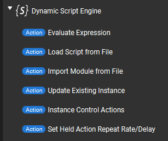
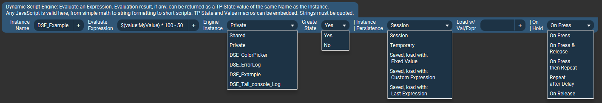
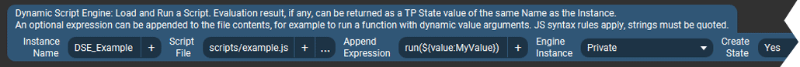
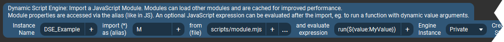
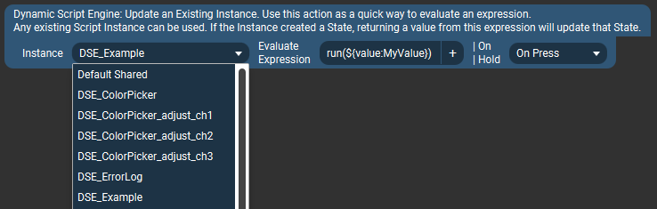
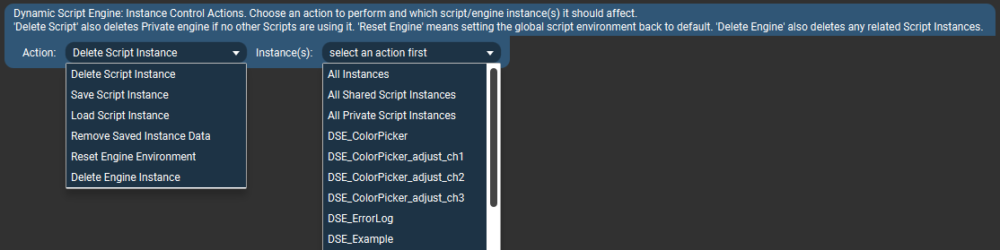
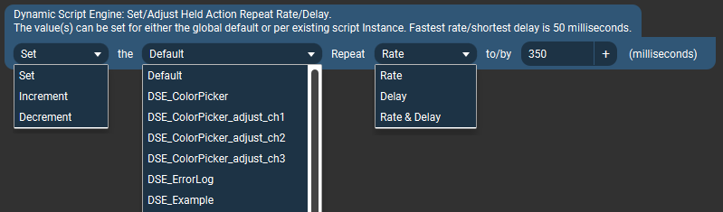

# Plugin Actions {#plugin_actions}

[TOC]

## Available Actions

___
### Evaluate Expression {#plugin_actions_evaluate}

This is the most basic action which evaluates an expression and optionally creates a new Touch Portal State with the value of the given expression's result.
The other actions described below all share the same options (as well as add some others). The common options are only explained here.

* **Instance Name** - This name uniquely identifies a "Script Instance." This name is used in various places to refer to this instance of a "dynamic script."
  Multiple Actions (and Connectors) can use the same Instance Name, however they will all change the properties of the same Script instance
  whenever they are used.  
  (Within the scripting engine environment, these are also literally Objects of type `DynamicScript` and all the options set in these actions
  are available as object properties.)
  * If the "Create State" option (described below) is enabled, this name will also be the name given to the new Touch Portal State once it is created. Once created it will appear in Touch Portal's various value selector lists.
  * As noted on the previous page, Touch Portal actually uses a "state ID" to identify states, and the names are used purely for display purposes.
  This plugin will generate a (hopefully) unique State ID by adding the prefix `dsep.` to whatever you put in the Instance Name field. However it's still up to the user to make sure this name is unique at least among other States being created by this plugin's actions/connectors.

* **Evaluate Expression** -- This is what you want to do. It can be any one-line valid JavaScript; basic math, reading/writing files, sending dynamic button icons...

  A key feature of evaluating expressions is that they can include value(s) that Touch Portal already has, for example as a Global Value or a State
  from a plugin or some other integration. Typically one would want to do something with an existing piece of data, such as a math operation
  shown in the simple example above. These Touch Portal values are embedded into the expression by inserting them into the desired place
  the same way those Values/States are used in other parts of the Touch Portal interface, like when you want to display their value somewhere.

  For example, in the image above the Expression is `${value:MyValue} * 100 - 50`  
  When this action is activated, the actual expression sent to the plugin will have `${value:MyValue} ` replaced by Touch Portal with an actual
  value of whatever `MyValue` is at the time.  Let's say the action gets triggered when `MyValue = 10`, so the Expression sent
  to the plugin is actually `10 * 100 - 50`.

  The limit is your imagination and the single-line nature of the action. There are some examples on the front page of this site and in the @ref examples_basic section.

* **Engine Instance** - This is an important distinction about how and "where" your script is run. Most one-line scripts will probably want to use the `Shared` types, while
  more complex scripts (described below) will likely want to use the `Private` types (but this is not a rule). Here is the difference:
  * **Shared** - All expressions/scripts are run in the same script evaluation engine instance, with a shared "global scope" as if they were all,
    to continue the poor analogies, running in the same "browser window" or "Node.js process." 
    This means, for example you could share variables or functions between script instances.
    It also means one expression/script could	overwrite variables/functions of another script in the same shared engine.
    For one-line expressions this is usually not an issue since they likely won't create variables anyway, but for the other actions types (below), it may. 
    **All Shared engine instances run in the same processing thread.** That means they cannot run at exactly the same time, one will need to finish before the next one
    will be processed. This is typically more efficient for relatively quick operations like math or text formatting or really anything that isn't going to take significant time, like
    reading a file or requesting a URL might.
  * **Private** - An isolated evaluation engine instance with its own "global scope." Multiple "Private" engines can be created, and each will persist
    until the plugin is stopped or it is explicitly deleted/removed by the user. 
    **Private engine instances run in their own processing thread.** This means multiple scripts can be running at the same time in parallel,
    and slower ones will not delay other processing. 
    The above all makes "Private" instances better suited for more complex scripts, which for example may need to create global variables
    or launch longer-running operation like reading a file or requesting a URL. On the other hand, each Private instance uses its own set of
    the computer's resources (mostly just some RAM), so creating a new engine for every simple script may add unnecessary overhead. 
    **Multiple Script instances can share a single "Private" engine instance.** 
    When you create a Script instance and select "Private" for the _Engine Instance_ option, this actually creates a named Engine Instance
    with the same _Instance Name_ as the Script. Once this Engine instance is created, it can be selected to be used by other Script instances. 
    In the image above I have two additional options available in _Engine Instance_ selector because they have already been created by
    other actions that have already executed/activated and created their corresponding Private engines.

* **Create State** - This setting determines if a Touch Portal State is automatically created for this Script instance. As described previously,
  if this setting is "Yes" then when the action is first invoked, a State with the same name as the Instance Name will be created and
  appear in Touch Portal's various value selector lists.
  Changing this setting to "No" _after_ a State has already been created will remove the State (the next time the action is invoked).

* **Instance Persistence** - This setting controls how long this Script instance will, essentially, exist in the plugin's memory.
  If the action is set up to create a Touch Portal State, this also dictates when the State exists and if it should be created automatically the
  next time the plugin starts.
  * **Session** - The Script instance (and any associated State) is only created when this action executes (runs) after the plugin has
    started. It will cease to exist when the plugin stops and will _not_ be re-created automatically next time the plugin starts.
  * **Temporary** - This named Script instance will be automatically deleted after a short time -- around 10 seconds after the last time the
    action gets invoked. If the action is invoked repeatedly, such as when used in On Hold button setup or in a Connector, it will still only
    get deleted once (after the last usage). If _Create State_ setting is "Yes" then the corresponding State will also be removed
    when the instance is deleted.
  * **Saved** - The Script instance will be stored in the plugin's persistent settings database when the plugin stops, and _will_
    be re-created automatically next time the plugin starts. This includes any associated Touch Portal State, so the State will essentially
    always exist as long as the plugin itself has been started.

    When the instance is restored from settings, it can be set to provide some default (starting) value for a State it creates, and/or it
    can be set to perform an evaluation (run some code) when it first loads. 
    The "**load with:**" sub-options shown in the selection list control this behavior:
    * **Fixed Value** - The instance is initialized without evaluating any code. If it creates a State, the initial value of the State will
      be exactly what is entered into the next _Load w/ Val/Expr_ field (which can also be empty/blank).
    * **Custom Expression** - After initializing, a script expression entered into the next _Load w/ Val/Expr_ field is evaluated.
      If the instance creates a State, the return value of this expression will be used as the initial State value (or be empty/blank if the
      expression doesn't return a value).
    * **Last Expression** - After initializing, the last saved _Evaluate Expression_ is evaluated. In other words it runs the same code as
      it would when the action is activated at any other time. 
      **However there is an important distinction**: If your expression is sending Touch Portal values as part of the expression (like
      parameters for a function), the "last saved expression" will contain the **last value(s) sent to the plugin.**

      Using the example from _Evaluate Expression_, above, where we use the Expression `${value:MyValue} * 100 - 50`: 
      Let's say that just before the plugin shuts down the last value of `MyValue` was `10` and the Expression sent
      to the plugin was `10 * 100 - 50`.  
      **This last Expression is what gets saved.** Including the actual value `10`.
      So, next time the instance is restored from settings, it can evaluate `10 * 100 - 50` and return that result.
      It _cannot_ determine the _current_ value of `MyValue` (there is no way to do this with Touch Portal, and in any case the plugin isn't
      even aware a "MyValue" variable was involved in the first place).

* **Load with Val/Expr** - As explained above, here you could enter a fixed default value to use as a State value at startup,
  or a custom expression to evaluate. 
  This field is ignored when the _Instance Persistence_ is anything besides the "Saved" options "load with Default Value" or "load with Custom Expression".

* **On Hold** - _This options is only relevant when the Action is being used in a Touch Portal button's "On Hold" setup area._ 
  This setting determines exactly _when_ script evaluation happens once the button is "activated:" pressed, held, or released.

  * **On Press** - Evaluates expression on initial button press only.
  * **On Press & Release** - Evaluates expression on initial button press and again when it is released.
  * **On Press then Repeat** - Evaluates expression on initial button press and repeatedly while it is held. Evaluation does _not_ happen again
    when button is released (it just stops repeating). 
    Initial repeat delay and the repeat rate can be set on either a global default level or per-instance -- see the last Action on this page.
  * **Repeat after Delay** - Ignores the initial button press and then starts repeating the evaluation after the active
    (either default or instance-specific) Action Repeat Delay time has passed. The evaluation will keep repeating (at the active Repeat Rate)
    until the button is released. Evaluation does _not_ happen again when button is released (it just stops repeating).
  * **On Release** - Evaluates expression only when button is released. 
    (This is the default behavior when using an action in Touch Portal's "On Pressed" button setup, which actually triggers actions upon button release.)

  Besides controlling the repeating behaviors, this setting can also be used as a trick to run different expressions on button press vs. button release. 
  Touch Portal will always run whatever is in a button's "On Pressed" setup area _when the button is released_. So one could put another action
  in the "On Hold" setup area which is activated (using this option) only _On Press_. This will run first, when the button is pressed,
  and when it is released the action(s) in "On Pressed" setup area will run.

### Load Script File {#plugin_actions_script}

This actions lets you load a JavaScript file and then (optionally) add an expression to execute after the script file is loaded. For example to invoke a function within the
script while passing it some dynamic arguments.

* **Script %File** - This is simply a path to your script file. By default, paths are relative tom the plugin's install folder,
  so you will likely want to use full paths here.
  * You can change the base path from which scripts (and modules, below) are loaded in the plugin's Settings in Touch Portal.
    See @ref plugin_settings section for details.
  * Paths on Windows can use forward (`/`) or back (`\`) slashes.
  * Paths can be typed (or pasted), or selected from a standard file dialog using the `...` button. Paths may also contain Touch Portal values as part of the names,
    (inserted via the `+` button) which will be evaluated as usual before being sent to the plugin.
* **Append Expression** - This is the JavaScript to run after the file has been loaded and evaluated. The expression is literally appended after the file contents.
  Typically this would be a call into a function from the loaded script, as shown in the example, but it could be any valid code that works with your loaded script file.

The rest of the fields are as described above.

### Import Module File {#plugin_actions_module}

This is a somewhat more advanced version of the _Load Script %File_ action. It is very similar but the advantage of JavaScript modules are that:
  1. Are cached in the script engine after first use. So they only load from disk once, and after that each subsequent import uses the cached version.
  2. They can import other JS modules for efficient code reuse and integrating with 3rd party modules.

This is absolutely the most efficient way to (re)use scripts in files.
However since they're cached, when you make changes to a module's code you must re-create the Script instance or reload the script's
Engine environment (there are actions for that, see below).
It may be quicker to develop and test your code as a standalone script and then turn it into a module once you have it working as you'd like.

* **import * as (alias)** - To use a function from a loaded module, the module must have an alias (these are JS rules).
  In typical JS syntax you'd usually use something like `import * as MyModule from "mymodule.js"` and then call functions
  from the module as `MyModule.someFunction()`. This _alias_ field is the equivalent of the "as name" part of the import statement. 
  The default import alias is just "M" to keep things short, but you can use whatever you want.
* **from file** - Specify the module's script file to load. This is just a path to a file, the same as described in the
  [Load Script File](#autotoc_md26) action above. Some conventions use an ".mjs" file extension to denote modules, but this is not required.
* **Evaluate expression** - Again this is like in the _Load Script %File_ action above. The expression gets invoked after the module has been imported.
  You can use it to call a function from the loaded module, for example. To call a module function the alias must be used here, as shown. 
  **Note** that modules must explicitly `export` a function (or variable) before it can be used from outside the module.
  The same applies here, the function you call in the expression must be marked as exported in the module itself, otherwise you get an undefined value TypeError.

The rest of the fields are as described in _Evaluate Expression_ action.

---
### Update Existing Instance {#plugin_actions_update}

This is a very simple action which evaluates an expression using an already existing dynamic script instance. It is the most efficient way to evaluate
a script expression.

The idea is that if you want to use the same instance/State in multiple places, it may be simpler to have the main, full, definition in only one place,
and simpler "update" action(s) in other places. This way one doesn't need to update all actions if a file path changes or you want a different default value,
for example.

This is particularly useful situations where script or module files have already been loaded, and all the other settings set up as desired,
and all an action needs to do is update some data or trigger some event in the existing environment.

* **Instance** - Any Script instance which has already been created by another Action can be selected from the list. When this action is activated,
  it will essentially replace the _Evaluate Expression_ of the selected Script instance with the expression specified in this action.

  **Default Shared** instance - this is special Script instance which always exists and can evaluate any arbitrary expression in the Shared engine
  scope. If the Shared engine has scripts or modules loaded, functions from those can also be invoked, as one might expect. This makes it very
  similar to using the _Evaluate Expression_ action in the Shared engine scope, with the main difference being that it cannot automatically create a State.

* **Evaluate Expression** - This is just like the corresponding _Evaluate Expression_ fields in the previous 3 actions, respectively. Meaning that
  you can just evaluate any arbitrary JavaScript, _or_ use a function from a script file if one has been loaded by a previous _Load Script File_ action,
  _or_ invoke a module's function if a module has already been imported (using the same syntax, eg. with the `M.` alias prefix).

The "On Hold" field is the same as described in the _Evaluate Expression_ action.

---
### Instance Control Actions  {#actions_plugin-action}

This is a collection of utilities for working with created Script and Engine instances.
It can be used to perform a variety of tasks based on the "Action" parameter.
Each of the actions can be applied to individual instances that have already been created, or in some cases to groups of instances.

The options available in the "Instances" selector will change based on which _Action_ is selected.

**Note**: Sometimes to get the _Instances_ list to update property it may be necessary to toggle the _Action_ selector to another value first
and then to the actual desired choice (it's a %TP thing).

* **Delete Script Instance** - Complete deletes all data related to this script instance, and removes the Touch Portal State if one was created.
  If the instance has been previously saved to settings (Persistence type of "Saved") then it will be removed from there as well the next time %DSE exits. 
  Note: If the instance being deleted used a Private Engine, and there are no other Script instances using the same Engine,
  then the Engine instance is deleted as well.
* **Save Script Instance** - Saves a Script instance (or all of them) to persistent storage (%DSE settings database). Any instance can be saved
  to settings at any time, but only instances specifically set to "Saved" _Persistence_ type will survive a %DSE restart.
* **Load Script Instance** - Restore a Script instance (or all of them) from persistent storage (%DSE settings database). This loads the
  specified named instance and evaluates it's startup expression (if any, see _Instance Persistence_ script action option).
* **Remove Saved Instance Data** - Permanently deletes all data in persistent storage (%DSE settings database) related to the selected Script
  instance.
* **Reset Engine Environment** - This restores a script environment (JS "global object") back to default,
  removing any variables/objects/etc created by scripts or expressions. If working with modules, this is a good way to clear the module cache. 
  Note that any scripts/modules will need to be re-loaded into the newly reset Engine as needed, since no previous data survives the reset.
* **Delete Engine Instance** - Completely deletes the Engine instance and any associated data, objects, etc. 
  Note: **All Script instances using the selected Engine instance will be deleted/removed as well.**

---
### Set Held Action Repeat Rate/Delay {#plugin_action_repeat_property}

This action can be used to set or adjust (increment/decrement) the repetition properties of actions (Script instances) when they are
used in the "On Hold" button setup area _and_ are configured to repeat when held (using one of the relevant On Hold action options as described above).

* **Action**
  * **Set** - Will set the selected property(ies) to a specific value.
  * **Increment / Decrement** - Changes the current property(ies) value by the specified amount.
* **Target**
  * **Default** sets the selected repeat property(ies) for all Script instances which do not have a corresponding value explicitly set.
  * Named instances - only affects the selected repeat property(ies) for the selected Script instance.
* **Property**
  * **Rate** - This is how often the action will repeat, or more specifically it is the interval between activations. So for example `350` means
    there will be a pause of 350 milliseconds between repeated activations. The repeat Rate takes affect after the initial repeat Delay period.
  * **Delay** - This is how long to wait before starting to repeat an action. For example initial activation happens when a button is first pressed,
    but it will not start repeating until it is still being held after this delay time.
* **Value** - A numeric value to set the property to or the amount of adjustment to apply.
  Time periods are specified in milliseconds (1000 ms per 1 second). The minimum repeat rate or delay is 50 milliseconds.

---

Read Next: [Connectors](Connectors.md)

@htmlonly
<map name="image-map">
    <area coords="0,40,285,75"   shape="rect" alt="Evaluate Expression action" title="Evaluate Expression action" href="#plugin_actions_evaluate">
    <area coords="0,75,285,105"  shape="rect" alt="Load Script File action" title="Load Script File action" href="#plugin_actions_script">
    <area coords="0,105,285,135" shape="rect" alt="Import Module File action" title="Import Module File action" href="#plugin_actions_module">
    <area coords="0,135,285,170" shape="rect" alt="Update Existing Instance action" title="Update Existing Instance action" href="#plugin_actions_update">
    <area coords="0,170,285,205" shape="rect" alt="Instance Control Actions action" title="Instance Control Actions" href="#actions_plugin-action">
    <area coords="0,205,285,240" shape="rect" alt="Set Held Action Repeat Rate/Delay action" title="Set Held Action Repeat Rate/Delay" href="#actions_action_repeat_property">
</map>
@endhtmlonly
