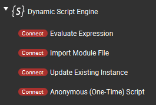
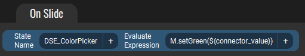

# Plugin Connectors (Sliders) {#plugin_connectors}

[TOC]

"Connectors" in Touch Portal-speak are essentially the equivalent of Actions for Buttons, but can (only) be used on Slider type controls (and of course vice versa that
Actions can't be used on Sliders). This plugin provides 4 of its Actions, documented on the previous page, as Connectors.

## Using Connectors

Besides the obvious difference in the "physical" control between buttons and sliders, the only practical difference as far as this plugin goes is that a connector/slider can,
optionally, pass the slider's current position value (0 - 100 range) to the expression/module function being invoked.

This is done by placing a special "placeholder," or macro, as a value wherever you'd like it to appear (eg. in a function invocation parameter, or as part of some expression calculation).
The placeholder gets replaced _by the plugin_ with a numeric value representing the slider position (an integer in the range of 0 through 100).

This magical placeholder is: `${connector_value}`

Here is an example shot of an "Update" type connector (from the @ref example_color_picker):

Here the _DSE_ColorPicker_ is an existing instance which imports a module. This connector invokes the `setGreen()` function in that module, and passes the slider's current
value as the only parameter to the function. When the plugin receives this connector event, it will replace `${connector_value}` with the actual numeric value
of the slider's position before invoking the `setGreen()` function. The end result would, for example, be `M.setGreen(35)`.

## Other Differences
- The "Load Script File" action is not available.
- The Action Type on "Anonymous (One-Time) Script" connector is limited to Expression and Module types.
- The "Create State at Startup" options are removed.
- As of v3.1, Touch Portal does not display any descriptions above the connector actions.

## Considerations
Sliders/connectors can produce events very quickly when they are being moved, up to around 10 updates per second (each). In theory a user could move as many sliders
at the same time as they have fingers, but even with just a couple of them moving at once, that's significantly fast input. If you try to do any operation when a slider
value changes that takes more than a few milliseconds to run, this could generally not end very well.

This is why the "Load Script" type connector (and option on "Anonymous") is not included. Believe me you do not want to be loading files from disk at 10Hz.
The Module type works fine because the modules are cached after first load, based purely on file name (there's not even a modification timestamp check or anything "expensive" like that).

Likewise the "Create at startup" options are removed to slightly optimize parsing the connector data on the plugin side. If you need a default, create it with an Action.
(Or let me know why that is a problem and we could reconsider the decision.)

The most efficient type of Connector is "Update Existing Instance" since that needs the least amount of pre-processing by the plugin before actually being evaluated.

## Updating Sliders from Scripts {#plugin_connectors_updating}

One of the benefits of having "native" sliders in this plugin itself is that we can track their use on pages and update their positions dynamically if we want to.
For example to reflect the value of some variable which was changed independently of the user moving the connector (eg. a volume was adjusted externally and the slider position
should represent the current value). Due to the nature of the Touch Portal Connectors API, it is difficult-to-impossible to update sliders provided by Touch Portal itself
(like "Set Value" connector), or other plugins [*].

To update the position of a Slider used on a Touch Portal page the program needs to know that Slider's special unique ID string. This could be a "long" ID comprised of
all the options currently selected in the connector (and some other parts), or a "short ID" which Touch Portal generates for each Slider instance. The "long ID" has a
limit of 200 characters, and is cumbersome to use in general, so this option usually isn't very useful. We pretty much need to use the generated "short IDs," but the
challenge is knowing which ID corresponds to which Slider/connector action since that data is only available from Touch Portal itself and may easily change.

To help with this conundrum Touch Portal sends special "short connector ID generated" messages to a plugin whenever that plugin's connectors are added to a page or edited
to reflect a new unique combination of options. These notifications are one-time and transitory, meaning if one needs to store the data for later reference (eg. which
short ID to update later when a value changes), one must implement that inside the plugin itself. A slew of these notifications may be sent when the plugin first starts up,
as Touch Portal sends one for each existing Slider instance. Notably though, these notifications are _only_ sent to the plugin which "provided" the connectors in the first
place... which is why we need "native" sliders in this plugin in order to be able to track their use properly.

So, the end result of all this is an in-memory database which this plugin maintains to store each Slider "short ID" reported by Touch Portal. Scripts can then query/search
this data to find the short IDs they may need, at any time. Once the script has the correct ID, sending an update is just a function call to `TP.connectorUpdate()` with
the ID and a numeric value.

The full API is documented over in the @ref TPAPI section, and access to the ID data specifically in the "Connector Data" subsection. 
The @ref example_color_picker makes extensive use of Sliders, both as input to change color values and for visual feedback of current values.

`*` A Touch Portal slider with _Set Value_ action can be adjusted externally by setting the corresponding Value, eg. with a `TP.stateUpdateById()` call using that Value's ID.
