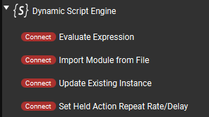
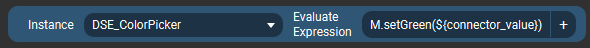
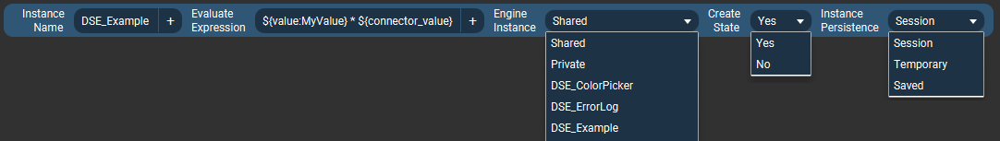
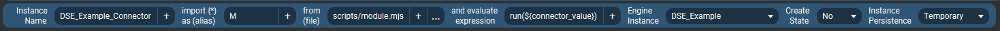
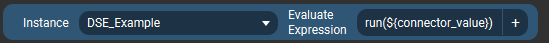
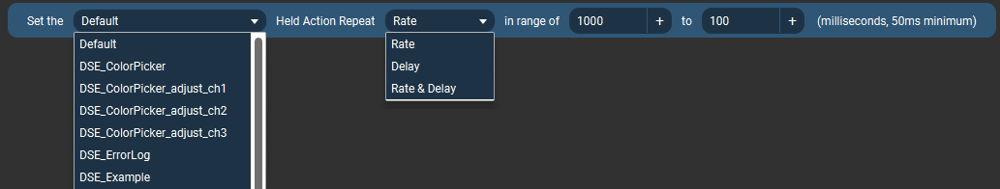

# Plugin Connectors (Sliders) {#plugin_connectors}

[TOC]

"Connectors" in Touch Portal-speak are essentially the equivalent of Actions for Buttons, but can (only) be used on Slider type controls (and of course vice versa that
Actions can't be used on Sliders). This plugin provides 4 of its Actions, documented on the previous page, as Connectors.

## Using Connectors

Besides the obvious difference in the "physical" control between buttons and sliders, the only practical difference as far as this plugin goes is that a connector/slider can,
optionally, pass the slider's current position value (0 - 100 range) to the expression/module function being invoked.

This is done by putting a special placeholder "token," or macro, wherever you'd like the slider's current position value to appear in your expression,
eg. in a function invocation parameter, or as part of some expression calculation.
The placeholder gets replaced _by the plugin_ with a numeric value representing the slider position (an integer in the range of 0 through 100).

This magical placeholder is: `${connector_value}`

Here is an example shot of an "Update" type connector (from the @ref example_color_picker):

Here the _DSE_ColorPicker_ is an existing instance which imports a module. This connector invokes the `setGreen()` function in that module, and passes the slider's current
value as the only parameter to the function. When the plugin receives this connector event, it will replace `${connector_value}` with the actual numeric value
of the slider's position before invoking the `setGreen()` function. The end result would, for example, be `M.setGreen(35)`.

## Considerations
Sliders/connectors can produce events very quickly when they are being moved, up to around 10 updates per second (each). In theory a user could move as many sliders
at the same time as they have fingers, but even with just a couple of them moving at once, that's significantly fast input. If you try to do any operation when a slider
value changes that takes more than a few milliseconds to run, this could generally not end very well.

This is why a "Load Script" type connector is not included.
Believe me you do not want to be loading files from disk at 10Hz. The Module type works fine because the modules are cached after first load,
based purely on file name (there's not even a modification timestamp check or anything "expensive" like that).

Likewise, the _Instance Persistence -> Saved_ sub-options are removed. If needed, they must be set using an Action and are then preserved if using a Connector with "Saved" persistence selected.

The most efficient type of Connector is "Update Existing Instance" since that needs the least amount of pre-processing by the plugin before actually being evaluated.

__Note__: As of v3.1, Touch Portal does not display any descriptions above the connector actions.

## Available Connectors

The options here are all pretty much as described for the corresponding Actions (on the previous page), so I'm not going to delve into all the details again.
The overall differences are already noted above. Only any specific differences are noted below.

Also of course there are no "On Hold" options for connectors since they do not provide such functionality.

___
### Evaluate Expression {#plugin_connector_evaluate}

As mentioned in "Considerations" section, the _Instance Persistence -> Saved_ sub-options are removed for efficiency.
If needed, they must be set using an Action and are then preserved if using a Connector with "Saved" persistence selected.

No other notable differences from the corresponding Action.

### Import Module File {#plugin_connector_module}

No other notable differences from the corresponding Action.

---
### Update Existing Instance {#plugin_connector_update}

Already demonstrated at top but included here for completeness. Again this works the same as the corresponding Action,
including the "Shared Default" instance being available in the _Instance_ selector (not shown here).

---
### Set Held Action Repeat Rate/Delay {#plugin_connector_repeat_property}

This connector can be used to set the repetition properties of actions (Script instances) when they are
used in the "On Hold" button setup area _and_ are configured to repeat when held (using one of the relevant On Hold action options).

* **Target**
  * **Default** sets the selected repeat property(ies) for all Script instances which do not have a corresponding value explicitly set.
  * Named instances - only affects the selected repeat property(ies) for the selected Script instance.

* **Property**
  * **Rate** - This is how often the action will repeat, or more specifically it is the interval between activations. So for example `350` means
    there will be a pause of 350 milliseconds between repeated activations. The repeat Rate takes affect after the initial repeat Delay period.
  * **Delay** - This is how long to wait before starting to repeat an action. For example initial activation happens when a button is first pressed,
    but it will not start repeating until it is still being held after this delay time.

* **In Range** - A numeric value range within which to set the property to, based on the slider's position. 
  In other words, how to apply the slider's 0 - 100 value range to the selected property value.

  In more words...  
  Time periods are specified in milliseconds (1000 ms per 1 second). The minimum repeat rate or delay is 50 milliseconds. There is
  no maximum, but anything longer than a second or few is probably not going to be practical anyway.

  A Touch Portal slider only changes a value in a range of 0 through 100, in whole number steps (0, 1, 2, 3, etc). If we just apply that range to our
  repeat rate/delay value, clearly that's not going to be very useful (we'd only be able to set the value within 50ms to 100ms, which isn't much of
  a difference and is a very fast repeat).

  Instead, it is much more useful to adjust the rate/delay in a range of, say 100 to 1000 milliseconds. Each slider "step" will change the value
  by 10ms, but this amount of change is barely noticeable so the resolution loss may be acceptable.

  Further, one may expect that when one moves the slider up, or to the right, the repeating gets _faster_, as in you're _increasing_ the speed
  by moving the control upward. (Granted this is a matter of perception, but I've tried it both ways and to me "up" seems like it should mean "faster.")
  But, a faster repeat actually means a shorter time interval between repeats (fewer milliseconds)... tricky, right?

  Using the _range_ settings we can also reverse the behavior of the slider so that moving it up or to the right will actually decrease the final
  value, and vice versa. As shown in the example, this is done by simply reversing the range so that the larger value comes first and the smaller value
  is last.

---
## Updating Sliders from Scripts {#plugin_connectors_updating}

One of the benefits of having "native" sliders in this plugin itself is that we can track their use on pages and update their positions dynamically if we want to.
For example to reflect the value of some variable which was changed independently of the user moving the connector (eg. a volume was adjusted externally and the slider position
should represent the current value). Due to the nature of the Touch Portal Connectors API, it is difficult-to-impossible to update sliders provided by Touch Portal itself
(like "Set Value" connector), or other plugins [*].

To update the position of a Slider used on a Touch Portal page the program needs to know that Slider's special unique ID string. This could be a "long" ID comprised of
all the options currently selected in the connector (and some other parts), or a "short ID" which Touch Portal generates for each Slider instance. The "long ID" has a
limit of 200 characters, and is cumbersome to use in general, so this option usually isn't very useful. We pretty much need to use the generated "short IDs," but the
challenge is knowing which ID corresponds to which actual Slider/connector instance since that data is only available from Touch Portal itself and may easily change.

To help with this conundrum Touch Portal sends special "short connector ID generated" messages to a plugin whenever that plugin's connectors are added to a page or edited
to reflect a new unique combination of options. These notifications are one-time and transitory, meaning if one needs to store the data for later reference (eg. which
short ID to update later when a value changes), one must implement that inside the plugin itself. A slew of these notifications may be sent when the plugin first starts up,
as Touch Portal sends one for each existing Slider instance. Notably though, these notifications are _only_ sent to the plugin which "provided" the connectors in the first
place... which is why we need "native" sliders in this plugin in order to be able to track their use properly.

So, the end result of all this is an in-memory database which this plugin maintains to store each Slider "short ID" reported by Touch Portal. Scripts can then query/search
this data to find the short IDs they may need, at any time. Once the script has the correct ID, sending an update is just a function call to `TP.connectorUpdate()` with
the ID and a numeric value.

The full API is documented over in the @ref TPAPI section, and access to the ID data specifically in the "Connector Data" subsection. 
The @ref example_color_picker makes extensive use of Sliders, both as input to change color values and for visual feedback of current values.

`*` As of Touch Portal v3.1, a Slider with _Set Value_ action can be adjusted externally by setting the corresponding Value, eg. with a `TP.stateUpdateById()` call using that Value's ID. However this is currently considered a %TP bug and may change in future versions.

---

Read Next: [Settings, States and Events](States.md)

