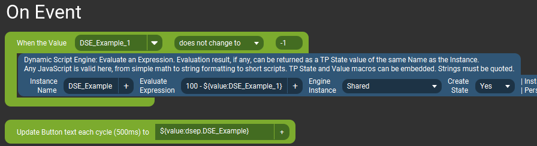

# Quick Start {#plugin_quick_start}

[TOC]

Relatively quick, anyway. Let's skip the theory and get down to it. If you're already familiar with how Touch Portal works then you'll be able to grok
most of this quickly and skip through basics. If you're a relative beginner, hopefully I've included enough details to get going.

On that note, make sure the plugin is actually installed first. The instructions for download and install are on the front page in the
[Download and Install](index.html#autotoc_md7) section. Check.

## Basic Action Usage

<ol>
<li>Create a new Touch Portal button on any page. Give it a name and/or background so you can find it later!</li>
<li>Add the _Dynamic Script Engine -> Evaluate Expression_ Action to the button, from the menu on the left.</li>
<li>Fill out the _Instance Name_ field. It could be anything, but let's say `DSE_Example` because that's nice and boring.</li>
<li>In the _Evaluate Expression_ field put `2 + 2`  
(I _did_ say this was _basic_).

The button should look something like this (click the images for larger versions):

</li>

<li>Save this button, then go to your Touch Portal device (Android/iOS), find this new button and press it. (That's technically 3 steps, but stick with me.)</li>
<li>_Nothing_ will happen! Or at least apparently so...</li>
<li>Edit this same button again, this time selecting the _On Event_ tab.</li>
<li>Add a _Logic -> Dynamic Text Updater_ Event from the left menu. (_Values -> When Plug-in State Changes_ could also be used.)</li>
<li>Click the `+` button next to the text field and navigate to the _Dynamic Script Engine -> Dynamic Values_ category, where you should now be able
  to select a new State named "DSE_Example".

  It should look something like this (the screenshot obviously also has other State's I've created, but ignore those).

  
</li>
<li>Save this button again. Now look at it on the %TP device... the button should now say "4" on it! 
  Pretty exciting, right?  And quite handy in case one forgets what 2 + 2 equals.

  
</li>

</ol>

 

### Note: The action creates the State!
One important takeaway here is that **the State we created will not exist until that button gets pushed once** (or rather until the action
which creates the State gets activated, somehow). This is why we need the 2-step process to set up the button -- one to create the action so we can trigger it,
and the second step to actually use the new State for something.

---
## Getting Dynamic

To make things slightly more interesting let's create a Touch Portal "Global Value" we can use to test with, and a way to change it. 
(If you already have some global Value to use for testing, you can just use that and skip the first 2 steps.)

<ol>
<li>
  
  Go to the Touch Portal "Values" tab, click the `+`  then _Add Value_.
</li>
<li>Fill out the fields in the dialog.
  <ul>
   <li>You can use any ID and Name you want, but for the example I'll use `DSE_Example_1` for both.</li>
   <li>Default value of `0` (zero).</li>
   <li>Value Type: %Number</li>
  </ul>
   
</li>
<li>Add some way to change the test Value. A Slider with a _Set Value_ Connector works nicely:

  

</li>
</ol>

---

OK, the slider will change the Value in a range of 0 (at the bottom) to 100 (at the top).
Let's say we want to reverse that, so as we slide up the value changes from 100 to 0 instead. Let's edit our example button from the first section.

We want our _Evaluate Expression_ to run whenever the global Value "DSE_Example_1" changes. To do that we can copy that action from the "On Pressed" tab
to the "On Event" tab, and then make a small edit to the expression.

<ol>
<li>
  Edit the button, copy the action from the "On Pressed" tab (right-click on it -> "copy all selected actions"), then switch to the "On Events" tab.
</li>
<li>
  Add a _Values -> When Value Changes_ Event from the left menu.
  <ul>
    <li>In the first dropdown list find and select the "DSE_Example_1" Value created earlier.</li>
    <li>In the second list select "does not change to".</li>
    <li>In the last field enter `-1` (minus one).</li>
  </ul>
</li>
<li>
  Right-click on the bottom part of that Event and select "Paste all copied actions."  This should put the action inside the Event (if it doesn't just drag it in there).
</li>
<li>
  Edit the _Evaluate Expression_ value so it now uses the global Value we created as "input" to a math expression (still pretty basic here): 
  `100 - ${value:DSE_Example_1}`

</li>
</ol>

The "On Event" tab should now look like this: 

Save that button, then go move the slider on the %TP device's screen. The button's text should update to show the reversed version of the global Value.
You can see the Value's actual... err.. value, change in the Values tab.  Very valuable, verily. (sorry)

You may notice the text on the button doesn't update very quickly and will lag behind where the slider really is. That's because the
"Dynamic Text Updater" Event only updates every 500 milliseconds, at best. This may sound fast but it's not (relatively speaking).

To fix this, replace the "Dynamic Text Updater" Event with a "When Plug-in State Changes" Event, and add a "Change button visuals" action inside there
which changes the button's text.

The updates will now be almost instant as you move the slider.

### Using Values and States in Expressions

While this was not an especially practical example, the key point here is that you can use _any_ existing Value or State as part of an expression.
They don't have to be numeric, and the produced result can also be in any format you need. The values/states can be passed to many of the plugin's
built-in functions (lots of math and formatting options, for example) to get desired results back.
And with the more "advanced" actions available in this plugin (which can use custom script files), the values/states can be sent to more sophisticated functions as well.

---
## Sliding Around

As a last "quick start" example I'll show how to use a Slider with one of the plugin's Connectors.

It will do the same thing as the example above, but without a Touch Portal Value. Which is redundant since a Slider already produces a value of 0-100 that
we can use directly.

<ol>
<li>
  Edit the Slider from the example above (or create a copy). Replace the Connector with _Dynamic Script Engine - Evaluate Expression_ from the left menu.
</li>
<li>Use the same "Instance Name" as before -- `DSE_Example` (or whatever you used). This will make sure the State also has the same name as the previous tests,
  and the button from the last example will update to show the State's value, w/out any modifications.</li>
<li>
  For the Expression value put in `100 - ${connector_value}`

  `${connector_value}` is a special token/macro which is replaced _by the plugin_ (not Touch Portal) with the value sent by the Slider (which is currently,
  as of %TP v3.1, always in the range of 0 - 100). This is done _before_ evaluating the expression.

  So what our expression does in the end is subtract the current value of the slider from 100.
  Which is exactly what the previous example did with the global Value.

</li>

<li>That's it. Save the slider and go move it around on the %TP device.  The value displayed on the button should update in the range of 100 to 0,
as it did in the last example.</li>

</ol>

---

Continue the Journey: [Basic Principles](Basic.md)

