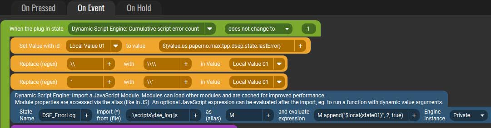

# Scripting Syntax and Caveats {#plugin_scripting}

[TOC]

## JavaScript Syntax Rules

The plugin evaluates JavaScript, so it follows that all JS syntax rules apply here as well. In particular:

* All text string must be quoted, either double (`&quot;`) or single (`&rsquo;`) quotes, or in backticks (`` ` ``) for "interpolated strings" (with embedded JS variables).
  If there are quotes of the same type within the text, they must be escaped with a backslash (`\`).<br/>
	For example: `run("A duck says \"quack\".")`. In such cases it would be simpler to wrap the text in single quotes, eg. `run('A duck says "quack".')`.
	Or vice versa if the text itself will contain single quotes.
* Literal backslashes (`\`) in text must be "escaped" with another one before it. So for example: `run("c:\\path\\to\\my\\file.txt")`
  * One a side note, all built-in functions which use file/directory paths accept forward slash (`/`) as the separator even on Windows. The above example can be written as `run("c:/path/to/my/file.txt")`.

While the above are not hard to follow when entering text/values manually like in the simple examples, keep in mind that dynamic variables (Touch Portal States and Values)
may contain quotes or backslashes. For example if a variable contains a path name on Windows, it likely has backslashes in it, which would need to be escaped before
evaluating as part of a JS expression.

In most cases this is probably not going to be an issue except in particular circumstances. For one thing this is never an issue with pure numeric values,
only some particular text.

I should note here that in some cases you may want to specifically include a "special character" like a newline to create a line break in resulting text.
This is perfectly legal, so to speak. For example the following would produce text with a line break in it:<br />
`Format("Expression result:\n{0:F2} things", ${value:MyValue} * .24)`
```
Expression result:
55.21 things
```


## Escaping Problem Characters

One way to deal with this is to use Touch Portal's replace-in-value action to escape any problem characters in the input. For example, this is a screenshot from
an action which takes the last error message reported by the script engine and sends it to a script (which color-codes and appends the line to the past few errors
and returns that as a new State):


<a href="images/doc/actions/example-escape.jpg" target="fullSizeImg"></a>

(The full script and button is available in [Examples](@ref example_line_logger) section.)

The event fires when the error count changes (described in [Status and Logging](03.Status.md)). It then processes the text of the last error message
(the `lastError` state, also described previously), which may contain backslashes and embedded quotes. Since Touch Portal's "replace" action can only be used on local and global
Values, it assigns the value of the error message to a temporary local value. It then replaces backslashes with two backslashes and double quotes with `\&quot;`.<br />
(You will notice that the backslashes within the regular expressions also need to be "escaped."  That's because regular expressions follow the same rules as
JS as far as those are concerned.)

Once the error log message is properly "escaped" of any potentially error-causing characters, it is then passed to the loaded module's `append()` function, wrapped in
double quotes (since we know those should be safe to use since we escaped any in the content).

<span class="next_section_button">
Read Next: [Examples](@ref plugin_examples)
</span>
