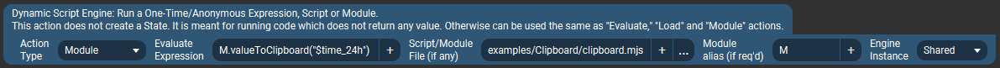
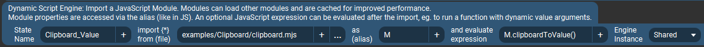

# Clipboard Utility Example {#example_clipboard}
Utility module for working with the system clipboard.

**See the [published documentation](https://mpaperno.github.io/DSEP4TP/example_clipboard.html) for a properly formatted version of this README.**

This is really a useful utility for copying text to and from the system clipboard. It can write the contents of either a variable or a file to the clipboard,
and also read the current clipboard contents into a file or return it as a string value.

As an example, it demonstrates the use of `Process` to launch an external program, wait for it to finish, and in the case of `clipboardToValue()`,
read what the program printed/returned to standard output (in this case the contents of the clipboard).

The clipboard interactions are done by invoking the appropriate system utility based on which operating system the plugin is currently running on.
On Windows this is the built-in `clip` command for writing to the clipboard, and a `PowerShell` command for reading.
On MacOS the built-in `pbcopy` and `pbpaste` commands are used, while on Linux the `xclip` utility is used (which may require installation).

The module's functions could be used directly from a Module type plugin action, and they can also be useful in other modules.  For an example of the latter,
see the [Color Picker](@ref example_color_picker) script which imports this module for copying color values to/from the clipboard (and in fact why it was created,
after I realized Touch Portal v3.1 lacked this functionality).

For example to copy a dynamic Value or State to the clipboard (here it is copy the current time in 24 hour format):

To copy a file's contents to the clipboard, you could use the same action but with the expression:

`M.fileToClipboard("/path/to/file.txt")`

Or to read the current clipboard contents and return the value as a Touch Portal State (here named "Clipboard_Value"):

@note This code can also be found in the project's repository at 
https://github.com/mpaperno/DSEP4TP/tree/main/resources/examples/Clipboard/

@include{lineno} clipboard.mjs
