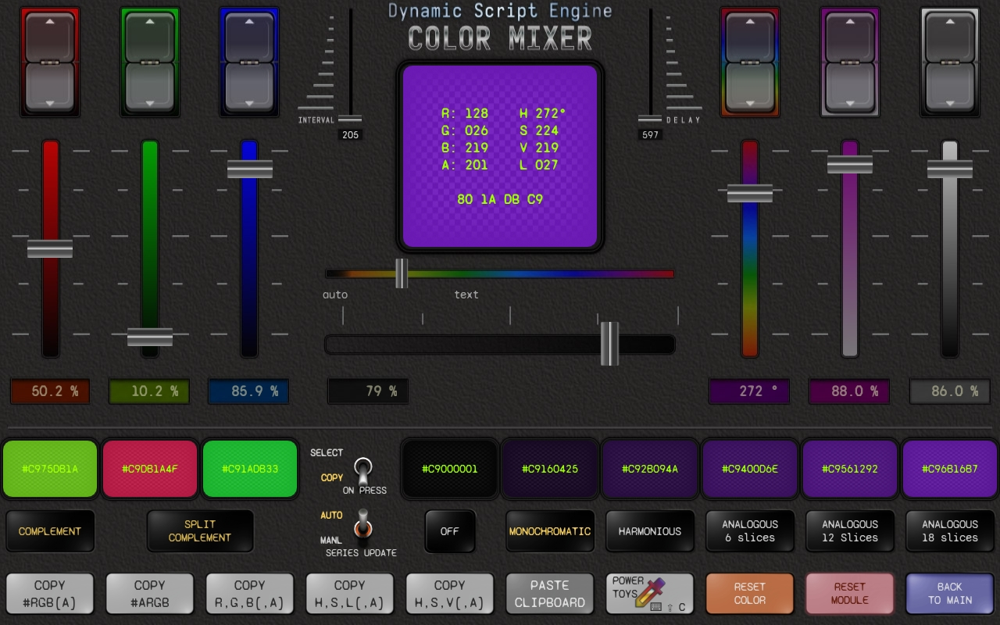

# Color Mixer Example {#example_color_picker}
A script and page example of an interface for choosing a color.

**See the [published documentation](https://dse.tpp.max.paperno.us/example_color_mixer.html) for a properly formatted version of this README.**

Besides being an actual useful tool, this example demonstrates how to use several available classes and Touch Portal integration features.
To create similar functionality would typically require a dedicated plugin in itself. But with _DSE_ it can be created with some relatively
simple scripting, and customized "on the fly" without editing configuration files or restarting Touch Portal for each change (also not needing yet another
network client and process running in the background).

### Plugin components and features used:
- Color library for the primary functionality (choosing and previewing colors).
- Using Touch Portal Sliders (connectors), both for input (to change color) and as a visual indicator of current channel values (move related sliders as color changes).
- Saving and restoring the last "state" of the color mixer page when Touch Portal/the plugin shut down and restart,
  including the last selected color, series, and the other options presented on the page.
- Clipboard features provided by the Clipboard module for copying colors to/from other applications and monitoring the clipboard for changes after
  a local color picker utility has been launched.
- Using separate Script instances for the color adjustment buttons which act independently of each other, with adjustable repeat rate and delay settings.

The script itself is mostly just an "interface" to the various color manipulation features available with a Color object. It stores an instance
of a Color value, which is the "current color," and all operations are performed on this color, after which it is usually sent back to Touch Portal
as a new color value to be displayed somewhere (like the central "swatch" in the example page).

The example page uses 7 Sliders as inputs to control various aspects of the color (color channel values and opacity).
Each color channel is controlled by a Slider and also the corresponding up/down buttons. The color can be changed from the same screen
using either RGB or HSV channels.  When a channel is modified in one color model (eg. Red), the changes are reflected in the other model's sliders,
eg. moving the hue/saturation/value to corresponding positions.

The up/down buttons for each input value are there because Touch Portal Sliders only have a resolution of 0 through 100 in whole steps (1, 2, 3, etc),
whereas most of the actual color values can be in a range of 0 through 255 (or 0-360 for Hue and fractional percent for saturation and value).
So, the buttons provide a way to "fine tune" the value to account for the missing resolution of the sliders.

An additional Slider is provided to rotate the swatch overlay text color, or to set it to automatic (white or black text depending on the
overall darkness of the main color).

Additionally there are buttons to invoke clipboard functions to copy the current color to clipboard in various formats, and another button to
set the current color _from_ a value on the clipboard (it has to be in one of the recognized formats... see `setColor()` notes in the code below).

Last but not least there are options to show colors complementary to the current one, or select one of a "series" of colors reflecting various aspects
of the current main color, such as harmonious or analogous colors.  These additional colors can be generated on demand by pressing the corresponding buttons,
and/or set to automatically update when the main color changes by toggling the "Auto Update" feature.

Pressing the color complement/series color swatches can either copy that color to the clipboard, or select it as the current main color, depending
on the "ON PRESS" switch position.

_All_ of the States necessary for all this functionality, are created dynamically in the script as needed. For example the color series States are only
created if that feature of the page is used.  Each individual color channel value (R/G/B/A/H/S/V) are sent as individual States, which in this page
are displayed under the corresponding sliders.

@note Assets for this example, including the code and page shown below, can be found in the project's repository at 
https://github.com/mpaperno/DSEP4TP/tree/next/resources/examples/ColorMixer/

### Example page using this script

### Initial page setup

1. Download the [DSE_Color_Mixer_v1 page](https://github.com/mpaperno/DSEP4TP/raw/next/resources/examples/ColorMixer/DSE_Color_Mixer_v1.tpz).
2. Import the page into Touch Portal
   - The script file used in the example are already included in the page's archive and will be copied into your Touch Portal data directory, into the "misc" subfolder.
3. Create a new button somewhere (eg. on your (main) page) that opens this page on your Touch Portal Android/iOS device.
4. Navigate to the new page on your device, and then press the INITIALIZE button.
   - This only needs to be done once when you first import the page. After that everything should be re-created automatically next time you start
   Touch Portal (or restart this plugin).
5. The "INITIAL SETUP" button should turn into a white color swatch and the page is ready for use.
6. If you make any changes to the included script file, you need to use the "Reset Module" button to clear out the old script version before your changes will be detected.

#### The "color picker" button
You may notice that button on the bottom row with the technicolor dropper icon. This is meant to launch a "color picker" utility on your computer,
which would then copy the color from any part of the screen you click on to the clipboard. This utility is going to be operating system-specific,
and you may prefer one over another.

The current button on the page is set up to launch the Windows 10/11 "Power Toys" Color Picker utility by pressing its default shortcut key combination of
`WIN+SHIFT+C`. (_Power Toys_ is a collection of utilities from a Microsoft-supported but independent open-source project.)  You may of course prefer some
other utility, and if you're on MacOS or Linux then clearly you'll need some other option.

After the button is pressed, the script will wait up to 30 seconds for the clipboard contents to change. If the clipboard is updated,
the new clipboard value is checked to see if it contains a valid color. And if it does, then the main selected color is changed to that value.

### Color Mixer script

@include{lineno} dse_color_mixer.mjs
