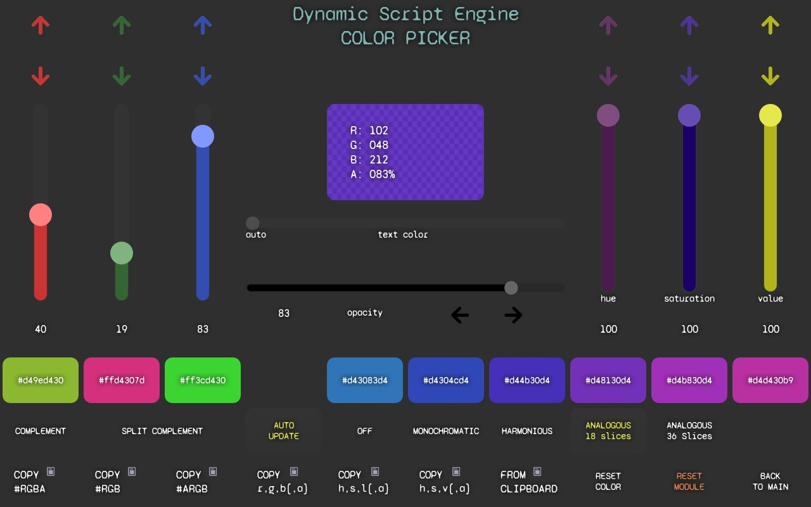

# Color Picker Example {#example_color_picker}
A script and page example of an interface for choosing a color.

**See the [published documentation](https://dse.tpp.max.paperno.us/example_color_picker.html) for a properly formatted version of this README.**

This example demonstrate some uses of the Color library to create a basic "color picker" type interface (scroll down for page screenshot).
It also uses the [Clipboard example](@ref example_clipboard) module for interacting with the system clipboard (copying colors to and from).

The script itself is mostly just an "interface" to the various color manipulation features available with a Color object. It stores an instance
of a Color value, which is the "current color," and all operations are performed on this color, after which it is usually sent back to Touch Portal
as a new color value to be displayed somewhere (like the central "swatch" in the example page).

The example page uses 8 global Touch Portal Values as inputs to control various aspects of the color (color channel values, opacity, saturation, etc).
Each Value is controlled by a Slider and also the corresponding up/down buttons. The central "color swatch" button is where the input value changes are
detected and sent to the loaded script (which then returns the new resulting color to use as the swatch background color).

Additionally there are buttons to invoke clipboard functions to copy the current color to clipboard in various formats, and another button to
set the current color _from_ a value on the clipboard (it has to be in one of the recognized formats... see `setColor()` notes in the code below).

The up/down buttons for each input value are there because Touch Portal Sliders only have a resolution of 0 through 100, whereas most of the actual color values
can be in a range of 0 through 255 (or 0-360 for Hue).  So, the buttons provide a way to "fine tune" the value to account for the missing resolution of the sliders.

@note Assets for this example, including the code and page shown below, can be found in the project's repository at 
https://github.com/mpaperno/DSEP4TP/tree/main/resources/examples/ColorPicker/

### Example page using this script

### Color Picker script

@include{lineno} color_picker.mjs
