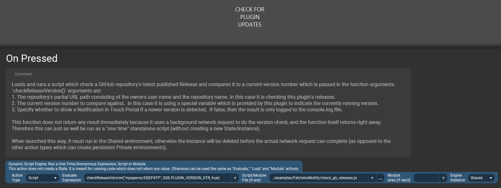

# Fetch and Notify Example - GitHub Release Version Check {#example_fetch_and_notify}

**See the [published documentation](https://mpaperno.github.io/DSEP4TP/example_fetch_and_notify.html) for a properly formatted version of this README.**

This example demonstrates serveral things:
1. Getting some data from a Web site using `Net.fetch()`, which in this case is in JSON format.
2. Extracting useful information from the JSON data.
3. Sending a Notification message to Touch Portal with `TP.showNotification()`, which a user can interact with.
4. Handle any choice (click) the user made in the notification dialog and open a Web browser with [Process.startCommand()](@ref Process).

It does this in the form of a version/update checker which contacts the GitHub server to get the latest
release version information of a particular repository (they have an API for that).

It can then compare the latest release version against a current version, and if a newer version is found it can send the Notification to Touch Portal for display.

The Notification contains a link to download the latest version. If the user clicks on that link, a callback function is executed in this code which
opens the default Web browser to the desired URL.

@note Assets for this example, including the code and sample button shown below, can be found in the project's repository at 
https://github.com/mpaperno/DSEP4TP/tree/main/resources/examples/FetchAndNotify/

@include{lineno} check_gh_releases.js

### Example usage on a button

