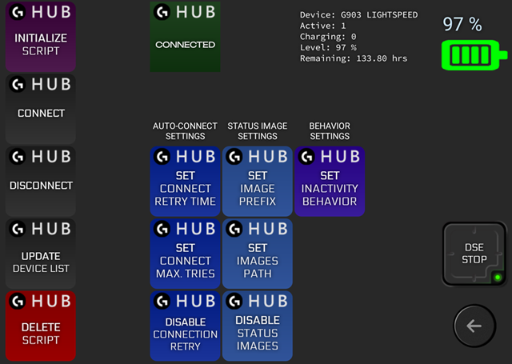
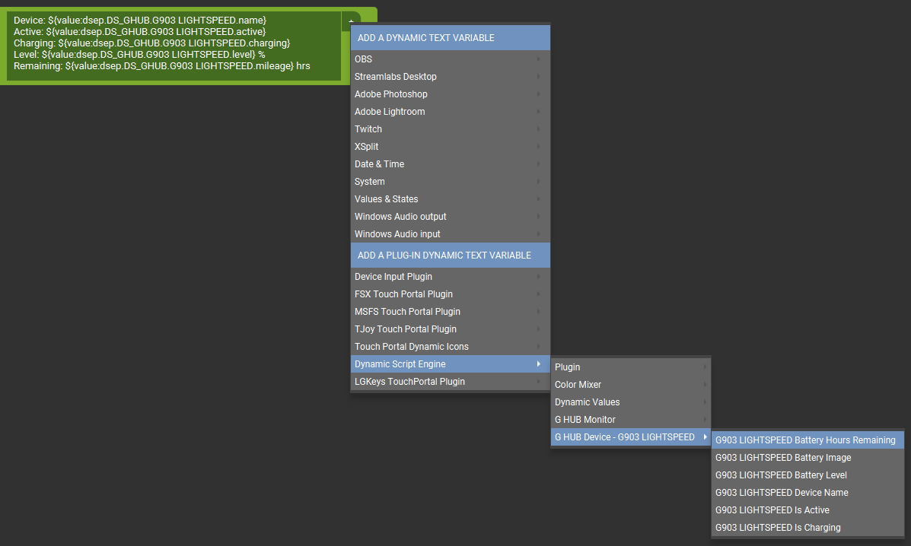

# Logitech™ G HUB® Battery Monitor {#example_ghub_monitor}

**A script to monitor battery level of Logitech™ G HUB® devices using WebSockets protocol.**

<div class="hide-on-site">

**See the [published documentation](https://dse.tpp.max.paperno.us/example_ghub_monitor.html) for a properly formatted version of this README.**
</div>

[TOC]

---

### Description

Once initialized, this script runs in the background and essentially acts as its own "plugin." It connects to the "secret" G HUB WebSockets server and reports battery status for each device GH shows as having a battery.

The script will create several *Touch Portal* states for each discovered device, indicating charge level, whether the device is currently active and/or charging, remaining battery hours, and so forth. There is also a state to indicate overall G HUB connection status.

Device battery status can be shown on any page, using standard *Touch Portal* buttons which react to plugin state changes.

The script is also set up to send battery status icons based on the current charge level and charging status (to be used as a *Touch Portal* button background).
Two example image sets are provided (horizontal and vertical battery orientation), custom sets could be substituted, or the image feature can be disabled altogether.

A *Touch Portal* page is provided for initial script setup and as a way to set some options (w/out having to modify the script directly).
This could be considered the script's "control panel." It also provides a visual status indicator of the G HUB connection, the *Dynamic Script Engine* plugin itself, and examples of device battery status buttons.

Once initialized (using the _INITIALIZE SCRIPT_ button on that control panel page), the script will **load itself automatically** each time the Dynamic Script Engine plugin starts, and attempt to open a G HUB connection.
So as long as G HUB is running, further interaction with the "control panel" page shouldn't be necessary.

The script can be configured to automatically retry connecting to G HUB, for example if G HUB is not running when the script starts or is stopped/re-started later. This is described in more detail below.

### Control Panel Page

<a href="example_ghub_monitor_page.png" target="image" title="Click to open in new window.">

</a>

Here is a brief rundown of what's on the page.

- In the **left column** are actions to do something with the script.
  - _INITIALIZE SCRIPT_ loads, or re-loads, the script and attempts to connect to G HUB. This button must be used at least once to set up the monitor script (see _Download & Setup_, below).
  	If any changes are made to the script source code, this button can be used to load the new version.
  - _CONNECT_ will initiate a connection attempt to G HUB (if not already connected).
  - _DISCONNECT_ will close any active connection (and not try to automatically re-connect if that feature is enabled).
  - _UPDATE DEVICE LIST_ will request a device list update from G HUB (it will try to connect first if needed). Generally there should be no need to request an update manually, but it may be useful in some situations.
  - _DELETE SCRIPT_ completely removes the script and all saved settings from the plugin's environment. The script will no longer load automatically at plugin start either. To restore the script (with default settings), the _INITIALIZE SCRIPT_ button must be used again.
- To the right of that, at the top, is a button to reflect the current G HUB connection status. This starts out with a transparent background color and the text "CONNECTION STATUS" before the script is initialized. It will transition between "CONNECTING", "CONNECTED", and "DIS-CONNECTED" depending on the current status, with corresponding color backgrounds (blue, green, and red, respectively).
- At the **top right** are two display-only buttons showing status of an actual G HUB battery device (a mouse).
  **Note** that unless you happen to also have a G903 mouse, the states used in both these buttons will need to be updated to use the ones created for your actual device(s).
  - The first is a simple "Dynamic Text Updater" *Touch Portal* event just showing all the available states for a device and their current values ([screenshot below](@ref example_ghub_monitor_device_states)).
  - The other is an example of what someone may actually use as a status display. It has events which react to the battery level and status image states changing.
- In the **middle** are the buttons for changing various options available as script **settings**. If this were a full plugin these options would be in the plugin's Settings page. As it is, their use is somewhat "unconventional."
  - **All the "SET" buttons must be edited before using**. The actual value which will be used to change the setting is part of the plugin action found in each button.
  - **Each button has comments** documenting what it does, the possible values, examples, any further instructions, etc.  Edit a button to see the comments.
  - The full list of available options, with further comments, can be seen in the script's source code (reproduced below), towards the top in the "Script runtime settings" section.
- At **bottom right** is a button showing status of the _Dynamic Script Engine_ plugin itself (green for running, red if stopped or unknown). This can also be used to stop/start the plugin.<br/>
  And of course the obligatory "back to main page" arrow.

### G HUB Connections

The script cannot connect to G HUB when GH isn't running, and it will be disconnected if G HUB stops running for whatever reason (an update, crash, manual restart, etc).

**By default the monitor script is configured to re-try a failed or dropped connection up to 20 times, every 30 seconds.**
After that it will stop trying and a new connection needs to be initiated manually using the _CONNECT_ button on the script's "control panel" page.

The time between tries can be changed using the _SET CONNECT RETRY TIME_ button, after editing it (as described above).
Setting the time to `0` (zero) will **disable** the automatic connection attempts entirely.

The maximum number of attempts can be changed using the _SET CONNECT MAX. TRIES_ button, after editing it.
If this is set to `0` (zero) then the script will attempt connections indefinitely.

The _DISABLE CONNECTION RETRY_ button sets the connection retry time to zero, disabling the feature.
To re-enable it, use the _SET CONNECT RETRY TIME_ button (by default, w/out editing the button, this sets the retry time to 30 seconds).

If the auto-connect feature is disabled or exceeds the maximum number of retries, the _CONNECT_ button can be used to attempt a connection manually once you know G HUB is running.
If auto-connect is enabled, this also resets the current retry count.

### Device Active Status

Some (all?) battery-powered devices will eventually go to sleep if unused for some period of time, and/or can be turned off with a switch on the device.
G HUB treats these as "not active" devices, meaning they're not entirely disconnected, but their actual status is unknown.
Similarly, if we get disconnected from G HUB, we don't know a device's status either.
Presumably, we want to know when this happens so we're not seeing a happy green "all good" battery icon when in fact we don't know what the charge level is.

Each monitored device has an associated "Is Active" *Touch Portal* state with a value of `0` (zero) for "inactive" or `1` (one) for "active."
When a device sleeps, for example, the state's value will change from one to zero, and vice versa when it wakes back up.
Changes to this state's value can be monitored as an event and actions applied as needed. (An example of this is included in the "control panel" page's battery status button.)

If G HUB gets disconnected (for whatever reason) or the whole Dynamic Script Engine plugin is stopped, then _all_ monitored devices are set to "inactive" state.

By default, when a device becomes inactive the script will also reset all of it's battery data to default "unknown" values (essentially like G HUB does).
The charge level and remaining run time state values are set to `-1` and the battery image (if used) changes to the "inactive" variant.

If you want to keep the last known battery details, the script has two other modes of operation which can be configured using the _SET INACTIVITY BEHAVIOR_ button (edit it and enable/activate the action which sets one of the modes). The three modes are:
- `reset` - the default behavior described above, resets all battery data and status image to "unknown"/"inactive" values.
- `keep` - keeps the last known battery data as-is, w/out resetting it, including the last status image (if images are enabled).
- `resetImage` - keeps the last known battery data but resets the battery status image to the "inactive" variant (if images are enabled).

### Download & Setup

1. Download the [GHUB Monitor Control Panel Page] and import it into *Touch Portal*.
   - The required script file is already included in the page's archive and will be copied into your *Touch Portal* data directory, into the "misc" subfolder.
   - Alternatively, the latest version of the script can also be downloaded separately: [ghub-monitor.mjs]
2. Download and import the [Battery Status Icon Pack]. Optional but recommended to get started. By default the script reads these icon files and sends them as images to reflect device battery level & charging status.
3. Create a new button somewhere (eg. on your (main) page) that opens the control panel page on your *Touch Portal* Android/iOS device.
4. Navigate to the new page on your device, and then press the _INITIALIZE SCRIPT_ button.
	 - This only needs to be done once when you first import the page/script. After that everything should be re-created automatically next time you start *Touch Portal* (or restart this plugin).
5. The G HUB status button should turn blue indicating a connection to G HUB is being attempted. If G HUB is running, this should turn green and indicate "CONNECTED." Otherwise it should turn red and indicate "DIS-CONNECTED."
6. Once G HUB is connected, the script will request a list of devices. The list is processed and any devices which report a battery status are added and will be monitored for changes. Once devices are added, new plugin states should be available which reflect each device's status. Each device's set of states are grouped together, see below for example screenshot.

If you connect a new battery-powered G HUB device to your computer after the script has already started and connected, G HUB should report this to the script and the new device will be added (or updated) automatically.  Removing a device from the system should act the same as if it went "inactive."

### Device States {#example_ghub_monitor_device_states}
Here's a screenshot of what a set of states created for a monitored device looks like and where to find them. The device name will vary of course, and you may have multiple devices. This example is from the "control panel" page. (Click for larger version).

<a href="example_ghub_device_states.png" target="image" title="Click for full version in new window.">

</a>

### Troubleshooting & Log

Everything the script does is logged to the plugin's log files. If there are any errors or other unexpected issues, they should be noted in the logs.
Normal activity like connection/disconnection or device discovery events are also recorded.

The logs are located in the plugin's installation folder, which is in *Touch Portal*'s "data" directory:
* **Windows**: `C:\Users\<User_Name>\AppData\Roaming\TouchPortal\plugins\DSEP4TP\logs`
* **Mac**: `~/Documents/TouchPortal/plugins/DSEP4TP/logs`

To continually monitor ("tail") the plugin's log file:
- **Windows**: open a PowerShell window, paste (<kbd>CTRL-V</kbd>) the following line, then hit <kbd>ENTER</kbd>
	```ps
	Get-Content -Tail 40 -Wait "$env:APPDATA\TouchPortal\plugins\DSEP4TP\logs\plugin.log"
	```
- **MacOS**: open a terminal window and paste the following:
  ```shell
	tail -F -n 10 ~/Documents/TouchPortal/plugins/DSEP4TP/logs/plugin.log
	```
To stop tailing the log, press <kbd>CTRL-C</kbd> or close the PowerShell/terminal window.

Further details on logging and plugin status can be found on the [Status and Logging](@ref plugin_status_and_logging) page.


### G HUB Monitor Script

**Note:** This is reproduced here for reference. The latest version can be downloaded directly: [ghub-monitor.mjs]

@include{lineno} ghub-monitor.mjs


### Trademark Notice

Logitech, Logi, G HUB, and their logos are trademarks or registered trademarks of Logitech Europe S.A. and/or its affiliates in the United States and/or other countries.

[GHUB Monitor Control Panel Page]: https://github.com/mpaperno/DSEP4TP/raw/next/resources/examples/GHUBMonitor/GHUB_Monitor_v1.tpz2
[ghub-monitor.mjs]: https://github.com/mpaperno/DSEP4TP/raw/next/resources/examples/GHUBMonitor/ghub-monitor.mjs
[Battery Status Icon Pack]: https://github.com/mpaperno/DSEP4TP/raw/next/resources/examples/GHUBMonitor/GHUB%20Monitor%20Icons.tpi
