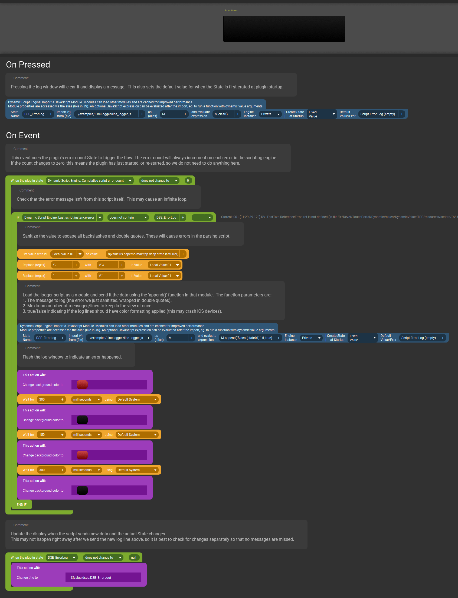

# Line Logger Example {#example_line_logger}
This is an example of collecting (accumulating) lines of text from a State or Value.

**See the [published documentation](https://mpaperno.github.io/DSEP4TP/example_line_logger.html) for a properly formatted version of this README.**

When the state/value changes, the new text is sent to this script.
It stores the last few lines and sends them back as a new State. The number of stored lines can be specified as a parameter to the `append()` function.

This particular example is tailored to collecting script errors from this plugin itself. It could be used as in the included Touch Portal button.

As described in [Status and Logging](@ref status_and_logging), every time an unhandled script error is detected the plugin updates the _**Last script instance error**_ State with
the error message. A Touch Portal event handler detects the change and sends that line of text to this script.
The script optionally also color-codes some parts of the error message; the error number, time stamp, and instance name.

@note Assets for this example, including the code and sample button shown below, can be found in the project's repository at 
https://github.com/mpaperno/DSEP4TP/tree/main/resources/examples/LineLogger/

@include{lineno} line_logger.js

### Example usage on a button

