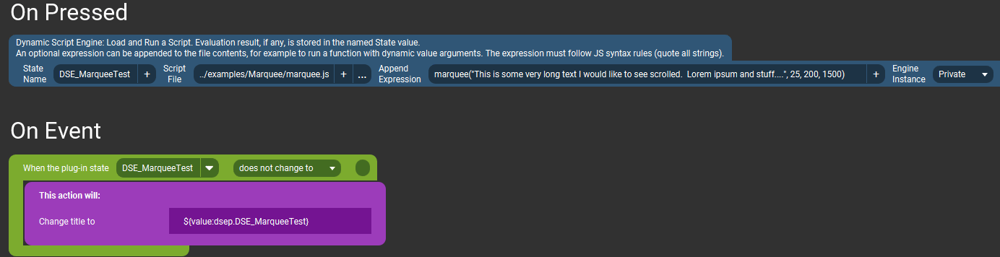

# Marquee Text Example {#example_marquee}
Scrolls long text horizontally with only a portion visible at one time.

**See the [published documentation](https://mpaperno.github.io/DSEP4TP/example_marquee.html) for a properly formatted version of this README.**

This script's main function, `marquee()`, takes a line of text as input and updates a Touch Portal State with a portion of that text visible (up to a specified maximum length),
pauses for some time, then sends the next set of characters that should be visible. This creates a scrolling animation like a marquee.

`marquee()` takes some optional parameters to specify how quickly the text should scroll, how long to delay before starting, or re-starting, the scroll,
and whether to restart the scroll after showing the full text once. See comments in the script itself for more details.

@note This code can also be found in the project's repository at 
https://github.com/mpaperno/DSEP4TP/tree/main/resources/examples/Marquee/

@include{lineno} marquee.js

### Example usage on a button

In an actual button/flow you would most likely put the action inside an event handler which reacts to a change in a State/Value you would like to display,
and put that State/Value's macro inside the quotes of the `marquee()` call, instead of my static example. Eg.

`marquee("${value:com.github.ChristopheCVB.TouchPortal.Spotify.TouchPortalSpotifyPlugin.BaseCategory.state.currentTrackName}")`

### Cancel marquee scroll
The script also has a function to cancel/stop the scroll animation on demand. Here is an example of a button for that. 
The key point is that it uses the same __State Name__ as the action which started the marquee to begin with (and also runs in a __Private__ instance).

