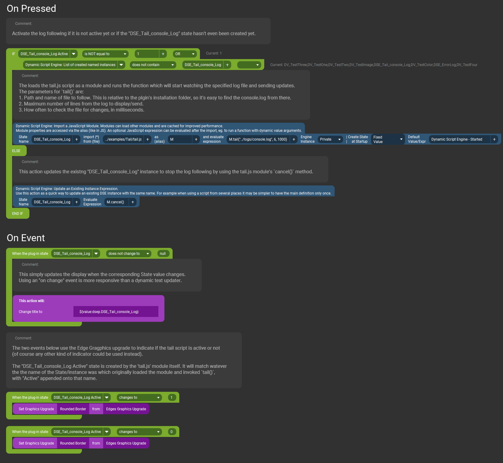

# Tail Example {#example_tail}
Example of checking a file at regular intervals and reading the last several lines of it when it changes. A.K.A "tailing" a file/log.

**See the [published documentation](https://mpaperno.github.io/DSEP4TP/example_tail.html) for a properly formatted version of this README.**

@note Assets for this example, including the code and sample button shown below, can be found in the project's repository at 
https://github.com/mpaperno/DSEP4TP/tree/main/resources/examples/Tail/

@include{lineno} tail.js

### Example usage on a button

