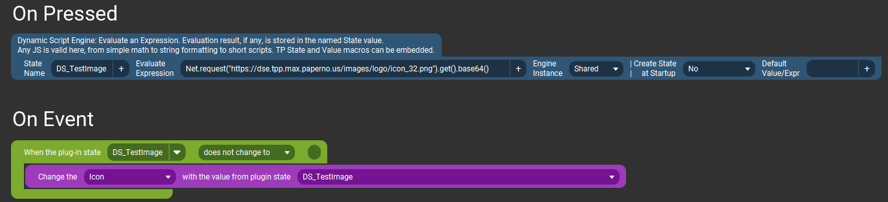
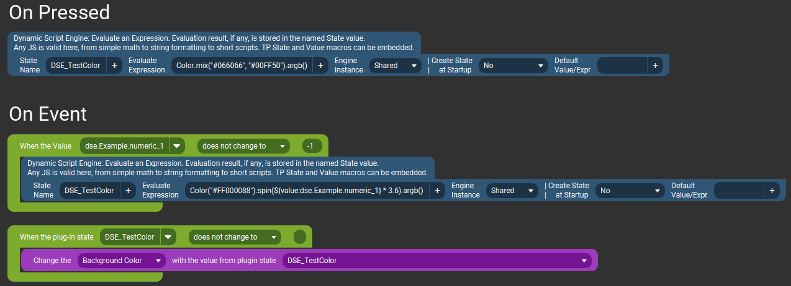

# Basic Usage Examples {#example_basic}
A collection of simple examples of using math, formatting, and other basic functions.

**See the [published documentation](https://dse.tpp.max.paperno.us/example_basic.html) for a properly formatted version of this README.**

[TOC]

These examples use States coming from another plugin (for Microsoft Flight Simulator), but any State or Value could be substituted in their place. 
The dynamic values (State names) are all in Touch Portal's usual `${value:value_name}` format as they appear when selected with the `+` button.

 

### Round a value to a whole number
Uses [Number.toFixed()](https://developer.mozilla.org/en-US/docs/Web/JavaScript/Reference/Global_Objects/Number/toFixed) standard JavaScript function.

### Convert feet to meters
Simple math operation on any numeric value (there are 0.3048 meters to one foot).

### Format a string to include a numeric value
This example results in "Ground Speed: 12 mph" based on current ground speed in knots (there are 1.150779448 knots to one mile). It uses the [Format](@ref Format) function.

### Inline conditional (ternary operator) results
A [ternary operator](https://developer.mozilla.org/en-US/docs/Web/JavaScript/Reference/Operators/Conditional_Operator) means,
in English, "if condition is true then do A, otherwise do B". The corresponding syntax is `condition ? A : B` 
This example sets the 'MSFS_StallWarning' state to "STALL" when the warning is active and to an empty string when the warning is not.

### Get an image from the Internet for a button icon
Uses `Net.request()` to get an image from a URL and send it to Touch Portal to be used as a button icon.

 
Download example button: <a href="https://github.com/mpaperno/DSEP4TP/tree/main/resources/examples/basic/DSE_RequestImageExample.tpb">DSE_RequestImageExample.tpb</a>

### Dynamic color background on a button
This example reacts to either a button press or a change in a test Touch Portal Value (with name/id `dse.Example.numeric_1`). 
One could add this Value in the Touch Portal _Values_ tab, and then for example set up a Slider to change the value (this varies the value between 0 and 100).
Moving the slider will then run through the whole gamut of color hues.

The example uses the `Color` class to perform color manipulation. This is used more extensively in the @ref example_color_picker.

 
Download example button: <a href="https://github.com/mpaperno/DSEP4TP/tree/main/resources/examples/basic/DSE_Color_Example.tpb">DSE_Color_Example.tpb</a>
